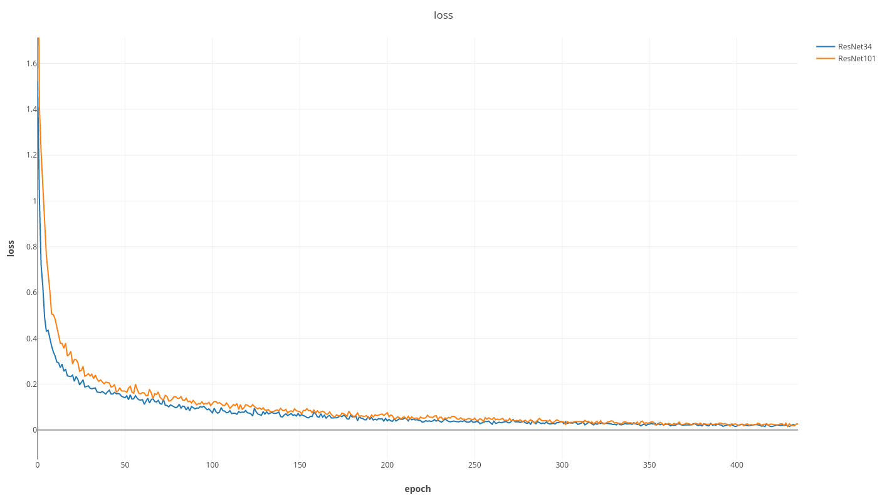
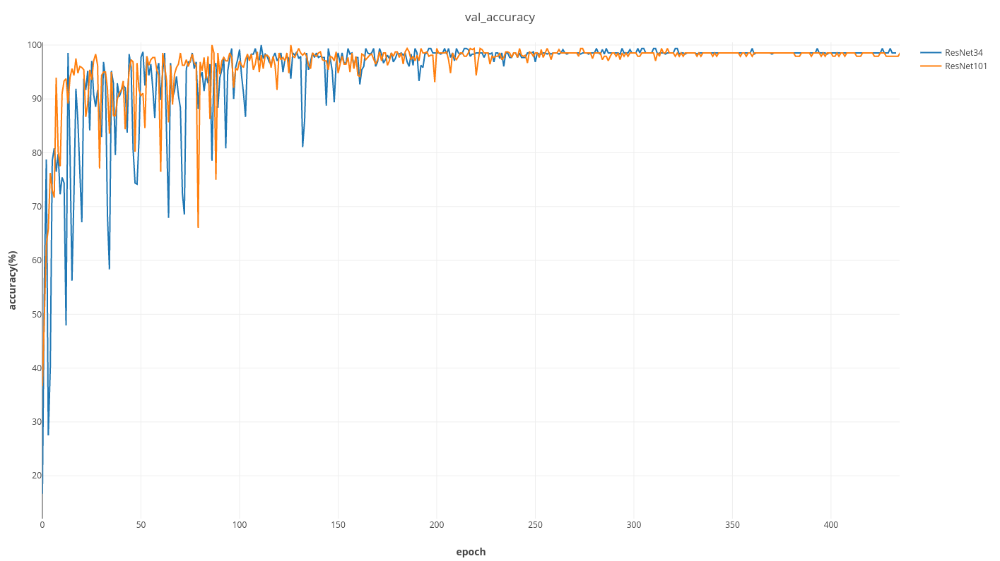

### 实验目的

对手势数字数据集进行分类。数据采用`./data/images/`中的数据。其中，训练集4324张，测试集484张，手势数字类别：0-5，图像大小均为64*64。

### 步骤

使用Pytorch为工具，以ResNet50或者ResNet101为基础，实现手势识别。

- 数据准备：
  - 训练：将image文件夹放在`./data/`路径下。[image文件下载](https://cloud.tsinghua.edu.cn/f/787490e187714336aae2/?dl=1)
  - 测试：将训练好的模型放在`./models/`路径下。 [模型下载](https://cloud.tsinghua.edu.cn/d/dbf0243babd443c49e21/)
- 训练步骤：
  - 首先使用`nohup python -m visdom.server &`打开`Visdom`服务器
  - 然后运行`classifier_train.py`即可。
  - 训练好的模型将以`.pth`文件的形式保存在`./models/`文件夹下。
- 测试步骤：
  - 修改`classifier_test.py`文件相关参数，其中`ckpt`表示模型加载位置，`testdata_dir`表示待测试图片文件夹。注意`ckpt`需要与`model`选择相对应。
  - 然后运行`classifier_test.py`即可。在控制台输出每张图片的预测结果。


## 方法

- 使用的库：PIL、torch、torchvision、numpy、visdom

- ResNet：

	对ResNet34及ResNet101两种网络进行实验。为了节省较深网络中的参数，ResNet34及ResNet101分别具有两种不同的基本“shortcut connection”结构。ResNet34使用BasicBlock，ResNet101使用	Bottleneck作为“shortcut connection”。


### 训练代码流程

1. Hyper-params: 设置数据加载路径、模型保存路径、初始学习率等参数。
2. Training parameters: 用于定义模型训练中的相关参数，例如最大迭代次数、优化器、损失函数、是否使用GPU等、模型保存频率等
3. load data: 定义了用于读取数据的Hand类，在其中实现了数据、标签读取及预处理过程。预处理过程在`__getitem__`中。
4. models: 从定义的ResNet类，实例化ResNet34及ResNet101网络模型。
5. optimizer、criterion、lr_scheduler: 定义优化器为SGD优化器，损失函数为CrossEntropyLoss，学习率调整策略采用ReduceLROnPlateau。
6. trainer: 定义了用于模型训练和验证的类Trainer，trainer为Trainer的实例化。在Trainer的构造函数中根据步骤二中的参数设定，对训练过程中的参数进行设置，包括训练数据、测试数据、模型、是否使用GPU等。
   Trainer中定义了训练和测试函数，分别为`train()`和`_val_one_epoch()`。`train()`函数中，根据设定的最大循环次数进行训练，每次循环调用`_train_one_epoch()`函数进行单步训练；
   训练过程中的loss保存在loss_meter中，confusion_matrix中保存具体预测结果；
   `_val_one_epoch()`函数对测试集在当前训练模型上的表现进行测试，具体预测结果保存在val_cm中，预测精度保存在val_accuracy中；
   最后，通过`Visdom`工具对结果进行输出，包括loss和accuracy以及训练日志。可以在浏览器地址 `http://localhost:8097` 中查看结果。

##　测试代码流程

1. Test parameters: 用于定义模型测试中的相关参数
2. models: 从定义的ResNet类，实例化ResNet34及ResNet101网络模型。
3. tester: 对测试类Tester实例化，Tester中主要进行模型加载函数与预测函数。
   `_load_ckpt()`函数加载模型；
   `test()`函数进行预测，其中定义了对单张图片进行预处理的过程，并输出预测结果。

### Result

- Loss

  

- accuracy



- 预测结果：

```
Processing image: img_0046.png
Prediction number: 0
Processing image: img_0000.png
Prediction number: 1
Processing image: img_0072.png
Prediction number: 2
Processing image: img_0080.png
Prediction number: 4
Processing image: img_0100.png
Prediction number: 5
Processing image: img_0014.png
Prediction number: 3
```

### Reference

- [pytorch](https://github.com/pytorch/pytorch)
- [pytorch-book](https://github.com/chenyuntc/pytorch-book)


